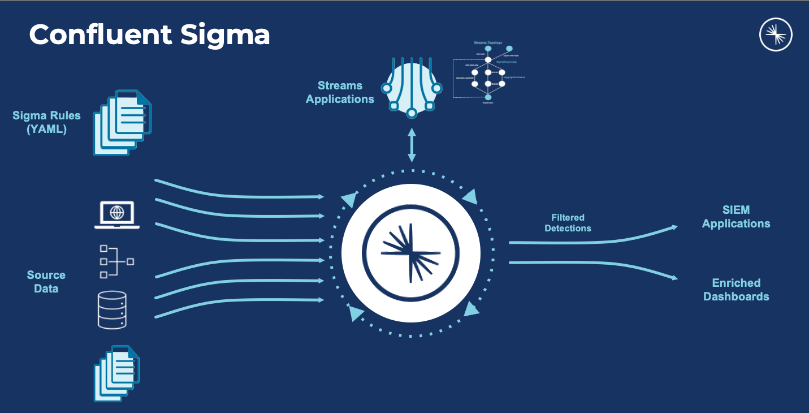
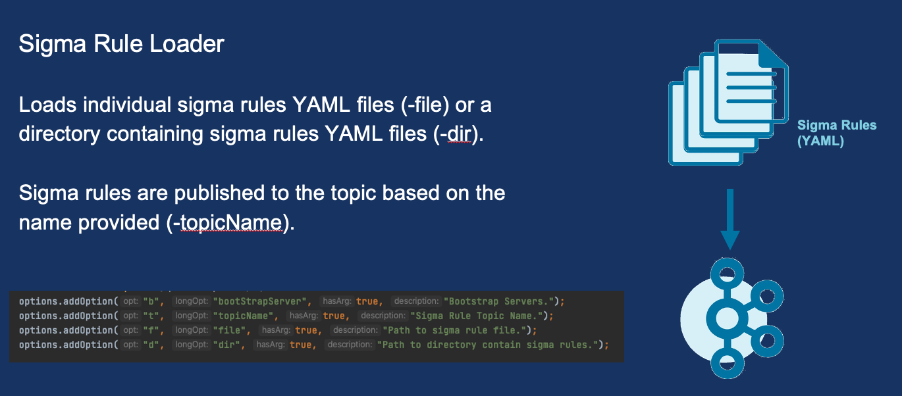
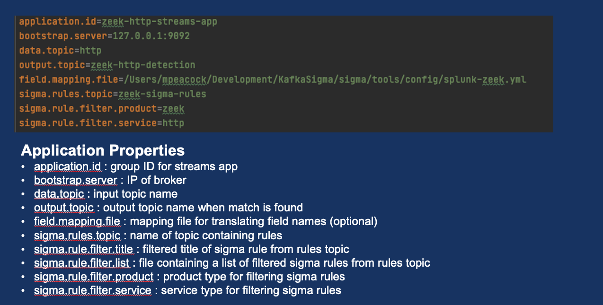

# Confluent Sigma
Confluent Sigma provides a way to leverage Confluent to identify anomalies on source data with Kafka Streams prior to 
sending to SIEM applications. Users can create Sigma Rules that are compared to real-time source data. When an anomaly 
is found, the source data and Sigma Rule metadata will be published to a user defined topic.

## Release

Latest release is 1.3.0.  Release notes [here](docs/release-notes-1.3.0.md)



## What is Sigma?
Sigma is a generic and open signature format that allows you to describe relevant log events in a straightforward 
manner. The rule format is very flexible, easy to write and applicable to any type of log file. The main purpose of 
this project is to provide a structured form in which researchers or analysts can describe their once developed 
detection methods and make them shareable with others.

Sigma is for log files what Snort is for network traffic and YARA is for files.

https://github.com/SigmaHQ/sigma


For more specifics on how sigma rules are applied in Confluent Sigma see [Sigma Rules](docs/sigma-rules.md)

## Modules

Confluent Sigma is composed of three modules.  [sigma-parser](sigma-parser) is a library used to parse and interact with
sigma rules in Java.  [sigma-streams-ui](sigma-streams-ui) provides a development oriented UI for interacting with 
the sigma streams process.  It enables you to see what rules have been published, add new rules, edit existing rules,
observe the status of running processors, and get a visualization of detections. The main module of the project is
[sigma-streams](sigma-streams) which contains the actual stream processor and associated command line scripts.  Commands
discussed here are found in [sigma-streams/bin](sigma-streams/bin).

## Getting Started

Sigma rules are published to a Kafka topic that the Sigma Stream processor is subscribed to.  These rules are then 
applied to a stream of data in another topic that the Sigma Streams is also subscribed to.  Matching records are then 
published to a new topic.  All three topics are provided in the configuration. The output topic cam be overidden by 
sigma rules allowing you to route to different topics based on rule.


### Sigma Rule Loading

Sigma Rules are persisted to a user-defined topic. The kafka record key for each record should be type string and set to
the title field of the rule.  Ideally we would use the ID field in the sigma specification but this is not a required 
field by the spec.  Since Confluent Sigma allows you to update sigma rules or remove them this means you cannot have
two seperate sigma rules with the same title. Newly published sigma rules WILL be picked up by the running Sigma Streams 
processor. 

### Sigma Rule Topic

Ensure the sigma topic is created prior to adding sigma rules.  Here is an example topic creation command but note that in production scenarios you will want a minimum replication-factor of 3.  Number of required partiions are unlikely to need to be more than 1 since rules are will be relatively low (compared to real event data)

`kafka-topics --bootstrap-server localhost:9092 --topic sigma_rules --replication-factor 1 --partitions 1 
--config cleanup.policy=compact --create`

Rules can be loaded into Kafka by using the SigmaRuleLoader application or via command line using kafka-console-producer.

### Sigma Rule Loader Application


If you wish to load just a single file you can use the `-file` option.  If you wish to load all files under a directory
use the `-dir` option.

Example: 

`sigma-rule-loader.sh -bootStrapServer localhost:9092 -topic sigma-rules -file zeek_sigma_rule.yml`

or

`sigma-rule-loader.sh -bootStrapServer localhost:9092 -topic sigma-rules -dir zeek_sigma_rules`


### Adding/Updating Sigma Rules via CLI
You can also use any standard kafka publisher to load rules.  Here is an examples of sending a record using the kafka-console-producer

```kafka-console-producer --bootstrap-server localhost:9092 --topic <topic-name> --property "parse.key=true" 
--property "key.separator=:"

{"title":Sigma Rule Test,"id":"123456789","status":"experimental","description":"This is just a test.", 
"author":"Test", "date":"1970/01/01","references":["https://confluent.io/"],"tags":["test.test"],"logsource": 
{"category":"process_creation","product":"windows"},"detection":{"selection":{"CommandLine|contains|all":
[" /vss "," /y "]},"condition":"selection"},"fields":["CommandLine","ParentCommandLine"],"falsepositives":
["Administrative activity"],"level":"high"}
```

### Sigma Streams Application


The Confluent Sigma streams app is a java application which you could run like a typical java application through the 
class file. A more convenient options is to use the confluent-sigma.sh script in bin

`bin/confluent-sigma.sh properties-file`

If you do not specify the property files it will check the `$SIGMAPROPS` environment variable to see if thats set.
if thats not set it will search the following directories for the existence of a sigma.properties

- `~/.config`
- `~/.confluent` 
- `~/tmp`

See example [sigma.properties](sigma-streams/config/sigma.properties) in sigma-streams config directory

