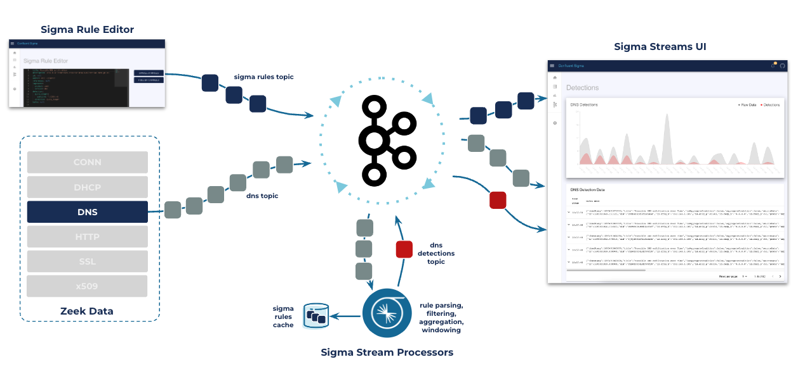
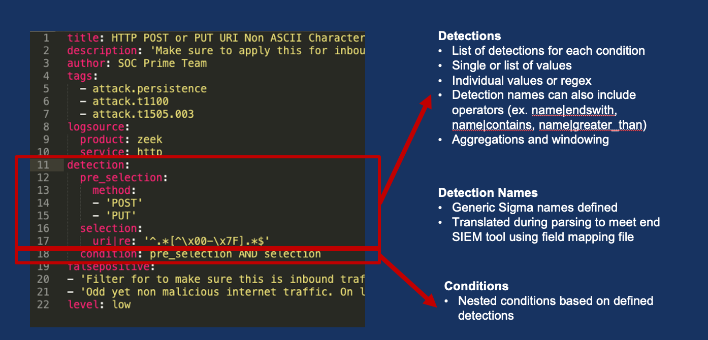

# Confluent Sigma
Confluent Sigma provides a way to leverage Confluent to identify anomalies on source data with Kafka Streams prior to 
sending to SIEM applications. Users can create Sigma Rules that are compared to real-time source data. When an anomaly 
is found, the source data and Sigma Rule metadata will be published to a user defined topic.

## What is Sigma?
Sigma is a generic and open signature format that allows you to describe relevant log events in a straightforward 
manner. The rule format is very flexible, easy to write and applicable to any type of log file. The main purpose of 
this project is to provide a structured form in which researchers or analysts can describe their once developed 
detection methods and make them shareable with others.

Sigma is for log files what Snort is for network traffic and YARA is for files.

https://github.com/SigmaHQ/sigma

## Sigma Rules

## Getting Started
### Sigma Rule Loading
Sigma Rules are persisted to a user-defined topic or topics. The key is the title of the rule and the value is a
stringified version of the YAML file.

Rules can be loaded into Kafka by using the SigmaRuleLoader application or via command line using kafka-console-producer.

### Sigma Rule Loader Application

Example: 

`sigma-rule-loader -bootStrapServer localhost:9092 -topic sigma-rules -file zeek_sigma_rule.yml`

or

`sigma-rule-loader -bootStrapServer localhost:9092 -topic sigma-rules -dir zeek_sigma_rules`

### Command Line
Sigma Rules are persisted in a log compacted topic. Ensure the topic is created prior to adding sigma rules.  Here is an example topic creation command but note that in production scenarios you will want a minimum replication-factor of 3.  Number of required partiions are likley to remain one or very low since rules are will be relatively low (compared to real event data)

`kafka-topics --bootstrap-server localhost:9092 --topic sigma_rules --replication-factor 1 --partitions 1 
--config cleanup.policy=compact --create`

### Adding/Updating Sigma Rules via CLI
`kafka-console-producer --bootstrap-server localhost:9092 --topic <topic-name> --property "parse.key=true" 
--property "key.separator=:"`

`{"title":Sigma Rule Test,"id":"123456789","status":"experimental","description":"This is just a test.", 
"author":"Test", "date":"1970/01/01","references":["https://confluent.io/"],"tags":["test.test"],"logsource": 
{"category":"process_creation","product":"windows"},"detection":{"selection":{"CommandLine|contains|all":
[" /vss "," /y "]},"condition":"selection"},"fields":["CommandLine","ParentCommandLine"],"falsepositives":
["Administrative activity"],"level":"high"}`

### Sigma Streams Application

Example:

`sigma-streams-app -c properties-file`
