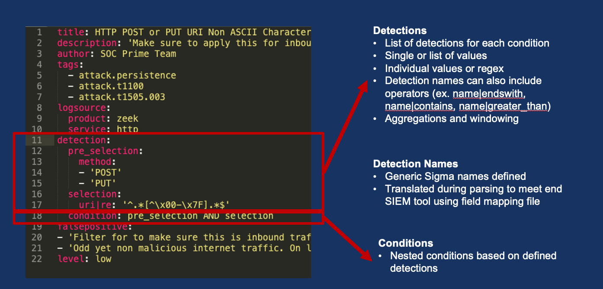
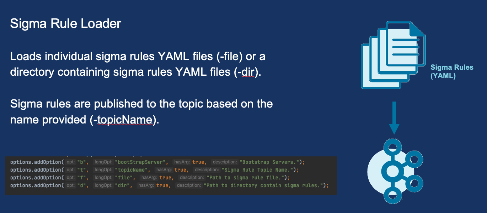
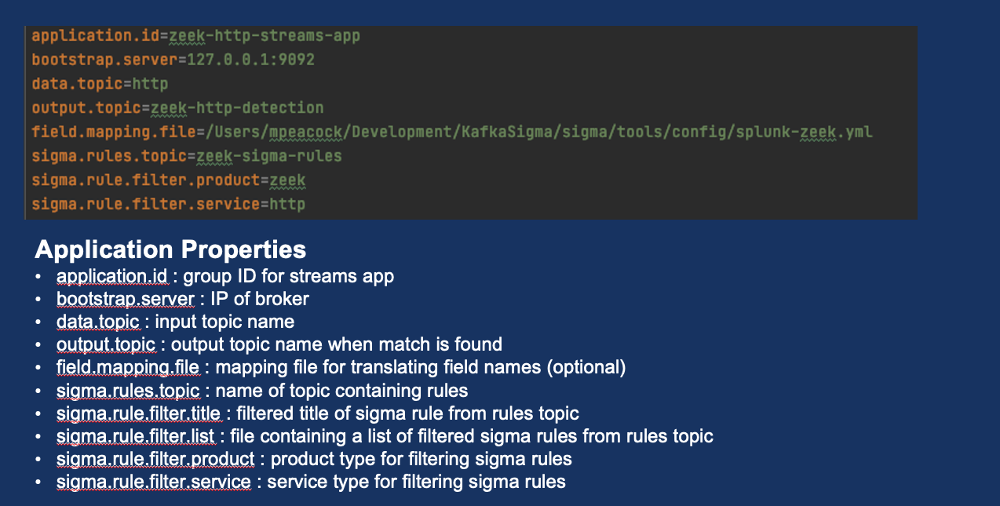

# Confluent Sigma
Confluent Sigma provides a way to leverage Confluent to identify anomalies on source data with Kafka Streams prior to 
sending to SIEM applications. Users can create Sigma Rules that are compared to real-time source data. When an anomaly 
is found, the source data and Sigma Rule metadata will be published to a user defined topic.


## What is Sigma?
Sigma is a generic and open signature format that allows you to describe relevant log events in a straightforward 
manner. The rule format is very flexible, easy to write and applicable to any type of log file. The main purpose of 
this project is to provide a structured form in which researchers or analysts can describe their once developed 
detection methods and make them shareable with others.

Sigma is for log files what Snort is for network traffic and YARA is for files.

https://github.com/SigmaHQ/sigma

## Sigma Rules


## Sigma Field Mappings

Sigma field mappings accept both Strings and JSON fields for comparison. Consider the following examples:

### String Support:

Field Mapping:
```
title: Splunk Zeek sourcetype mappings
order: 20
backends:
  - splunk
  - splunkxml
  - corelight_splunk
fieldmappings:
  dst_ip: id.resp_h
  dst_port: id.resp_p
  network_protocol: proto
```

The above field mapping will successfully compare dst_port to a Sigma rule concerned with port 53 when source data looks like this:
```
{
    "id.resp_h": "192.168.1.1",
    "id.resp_p": 53,
    "proto": "udp"
}
```

The above field mapping will NOT compare dst_port to a Sigma rule concerned with port 53 when source data looks like this:
```
{
    "id": {
        "resp_h": "192.168.1.1",
        "resp_p": 53,
    },
    "proto": "udp"
}
```

### JSON Support:

For nested JSON field comparisons, you MUST include a $. at the beginning of the field mapping, otherwise it will compare as a String.

Field Mapping:
```
title: Splunk Zeek sourcetype mappings
order: 20
backends:
  - splunk
  - splunkxml
  - corelight_splunk
fieldmappings:
  dst_ip: $.id.resp_h
  dst_port: $.id.resp_p
  network_protocol: proto
```

The above field mapping will successfully compare dst_port to a Sigma rule concerned with port 53 when source data looks like this:

```
{
    "id": {
        "resp_h": "192.168.1.1",
        "resp_p": 53,
    },
    "proto": "udp"
}
```

The above field mapping will NOT compare dst_port to a Sigma rule concerned with port 53 when source data looks like this:
```
{
    "id.resp_h": "192.168.1.1",
    "id.resp_p": 53,
    "proto": "udp"
}
```

## Getting Started

Sigma rules are published to a Kafka topic that the Sigma Stream processory is subscribed to.  These rules are then appied to a stream of data in another topic that the Sigma Streams is also subscribed to.  Matching records are then published to a new topic.  All three topics are provided in the configuration. 

### Sigma Rule Loading
Sigma Rules are persisted to a user-defined topic or topics. The key is the title of the rule and the value is a
stringified version of the YAML file.  Newly published sigma rules WILL be picked up by the running Sigma Streams processor.  If a rule with the same name as a previous rule is published it will replace it.

### Sigma Rule Topic
Ensure the sigma topic is created prior to adding sigma rules.  Here is an example topic creation command but note that in production scenarios you will want a minimum replication-factor of 3.  Number of required partiions are unlikely to need to be more than 1 since rules are will be relatively low (compared to real event data)

`kafka-topics --bootstrap-server localhost:9092 --topic sigma_rules --replication-factor 1 --partitions 1 
--config cleanup.policy=compact --create`

Rules can be loaded into Kafka by using the SigmaRuleLoader application or via command line using kafka-console-producer.

### Sigma Rule Loader Application


Example: 

`sigma-rule-loader -bootStrapServer localhost:9092 -topic sigma-rules -file zeek_sigma_rule.yml`

or

`sigma-rule-loader -bootStrapServer localhost:9092 -topic sigma-rules -dir zeek_sigma_rules`


### Adding/Updating Sigma Rules via CLI
You can also use any standard kafka publisher to load rules.  Here is an examples of sending a record using the kafka-console-producer

```kafka-console-producer --bootstrap-server localhost:9092 --topic <topic-name> --property "parse.key=true" 
--property "key.separator=:"

{"title":Sigma Rule Test,"id":"123456789","status":"experimental","description":"This is just a test.", 
"author":"Test", "date":"1970/01/01","references":["https://confluent.io/"],"tags":["test.test"],"logsource": 
{"category":"process_creation","product":"windows"},"detection":{"selection":{"CommandLine|contains|all":
[" /vss "," /y "]},"condition":"selection"},"fields":["CommandLine","ParentCommandLine"],"falsepositives":
["Administrative activity"],"level":"high"}
```

### Sigma Streams Application


Example:

`sigma-streams-app -c properties-file`
