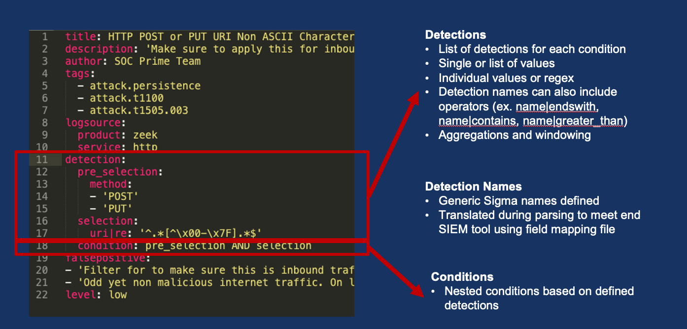

## Sigma Rules


## Sigma Field Mappings

Sigma field mappings accept both Strings and JSON fields for comparison. Consider the following examples:

### String Support:

Field Mapping:
```
title: Splunk Zeek sourcetype mappings
order: 20
backends:
  - splunk
  - splunkxml
  - corelight_splunk
fieldmappings:
  dst_ip: id.resp_h
  dst_port: id.resp_p
  network_protocol: proto
```

The above field mapping will successfully compare dst_port to a Sigma rule concerned with port 53 when source data looks like this:
```
{
    "id.resp_h": "192.168.1.1",
    "id.resp_p": 53,
    "proto": "udp"
}
```

The above field mapping will NOT compare dst_port to a Sigma rule concerned with port 53 when source data looks like this:
```
{
    "id": {
        "resp_h": "192.168.1.1",
        "resp_p": 53,
    },
    "proto": "udp"
}
```

### JSON Support:

For nested JSON field comparisons, you MUST include a $. at the beginning of the field mapping, otherwise it will compare as a String.

Field Mapping:
```
title: Splunk Zeek sourcetype mappings
order: 20
backends:
  - splunk
  - splunkxml
  - corelight_splunk
fieldmappings:
  dst_ip: $.id.resp_h
  dst_port: $.id.resp_p
  network_protocol: proto
```

The above field mapping will successfully compare dst_port to a Sigma rule concerned with port 53 when source data looks like this:

```
{
    "id": {
        "resp_h": "192.168.1.1",
        "resp_p": 53,
    },
    "proto": "udp"
}
```

The above field mapping will NOT compare dst_port to a Sigma rule concerned with port 53 when source data looks like this:
```
{
    "id.resp_h": "192.168.1.1",
    "id.resp_p": 53,
    "proto": "udp"
}
```
